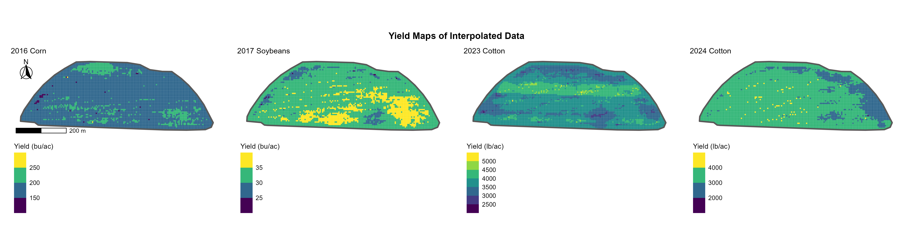
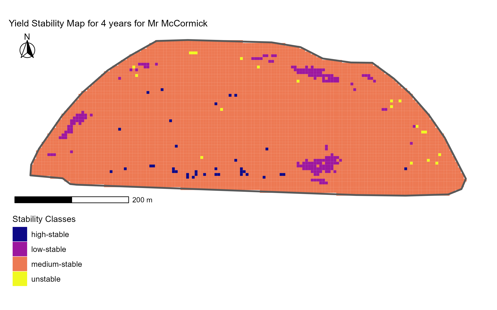

# Precision Agriculture Analysis: McCormick Field, Georgia

A comprehensive precision agriculture analysis of a 50-acre row-crop field 
in southeastern Georgia, using four years of yield monitor data, soil 
sampling, ECa surveys, terrain data, and Sentinel-2 satellite imagery to 
develop variable-rate management zones and a fertilizer prescription 
recommendation.

## Project Overview

This project applies a complete precision agriculture workflow to evaluate 
whether variable-rate nitrogen (VRN) management is justified for a specific 
field. The analysis integrates multi-year yield data, soil properties, 
terrain characteristics, and remote sensing to identify management zones, 
characterize their agronomic differences, and produce a data-driven 
recommendation for the next growing season.

**Field:** 50-acre back field, southeastern Georgia  
**Years analyzed:** 2016 (corn), 2017 (soybeans), 2023 (cotton), 2024 (cotton)  
**Next crop planned:** Corn

## Workflow

### 1. Data Cleaning and Preparation
- Imported and cleaned yield monitor data for four crops/years
- Applied a 20 m negative buffer to remove edge effects
- Removed yield monitor outliers (impossible values, sensor errors)
- Standardized CRS across all spatial layers (EPSG:6345, UTM Zone 16N)

### 2. Spatial Interpolation
- Created a 5 × 5 m interpolation grid covering the field
- Interpolated yield, soil ECa (shallow and deep), soil nutrients (P, K, pH), 
  elevation, and terrain derivatives (slope, aspect, flow direction) using 
  IDW
- Standardized yields across years using percent-of-field-mean to allow 
  direct comparison across crops with different units

### 3. Yield Stability Analysis
- Calculated mean and CV of standardized yield across all years per pixel
- Classified pixels into stability classes: high-stable, medium-stable, 
  low-stable, and unstable
- Result: 96% medium-stable, confirming overall field uniformity

### 4. Management Zone Delineation
- Used K-means clustering on soil and terrain variables (P, K, pH, ECa 
  shallow, ECa deep, elevation, slope) to define management zones
- Selected 2 clusters as optimal based on within-cluster sum of squares 
  (WSS) and silhouette score, with majority-vote across multiple methods
- Applied 7×7 focal mean smoothing to produce contiguous, manageable zones

### 5. Cluster Validation
- Validated clusters against multi-year yield data using Tukey HSD letter 
  separation
- Found significant but practically small yield differences in 3 of 4 years 
  (2016, 2017, 2024); no significant difference in 2023 cotton
- Compared yield-based stability classes to remote-sensing GNDVI-based 
  stability classes from Sentinel-2 imagery

### 6. Variable-Rate Prescription
- Calculated yield potential per zone using 90th percentile of 2016 corn 
  yields
- Generated VRN prescriptions in lb N/ac and gal/ac of UAN 28%
- Result: zones differed by only 0.3 lb N/ac (and 0.1 gal/ac UAN) — too 
  small to justify variable-rate application

## Key Findings

1. **The field is highly uniform.** Maximum CV across years was 27%; mean 
   yield ranged only from 97–103% of field average across pixels.

2. **The two management zones differ in soil texture and elevation.** 
   Cluster 1 has higher ECa, higher K, lower P), and Cluster 2 has lower ECa, 
   lower K, higher P.

3. **These soil differences don't translate into meaningful yield differences.** 
   Cluster 2 was slightly more stable across years, but yield potentials 
   were essentially identical (~201 bu/ac for both zones).

4. **Variable-rate N is not justified for this field.** N rates between 
   zones differ by less than 1 lb N/ac, well below the precision of any 
   application equipment and any economic decision threshold.

5. **Recommendation:** Apply a uniform N rate of approximately 169 lb N/ac 
   (or 56.5 gal/ac UAN 28%) across the entire field for the upcoming corn crop.

## Tools and Packages

Some tools and packages used are:

- **R** with **RStudio** for the entire workflow
- **sf**, **stars**, **terra** — spatial data handling and raster operations
- **gstat** — IDW interpolation
- **dplyr**, **tidyr** — data wrangling
- **ggplot2**, **ggspatial**, **patchwork** — mapping and visualization
- **gt** — publication-quality tables
- **NbClust** — clustering and cluster validation
- **openEO** — Sentinel-2 satellite data access for GNDVI analysis

## Repository Structure
.
├── data/               # Raw and intermediate spatial data

├── code/               # R scripts for each workflow step

├── output/             # Generated maps, tables, and prescriptions    

└── README.md

## Acknowledgments

This project was completed as part of a precision agriculture course, 
applying the analytical workflow to real field data provided by Mr. McCormick.

## Author

Comfort Adegbenro