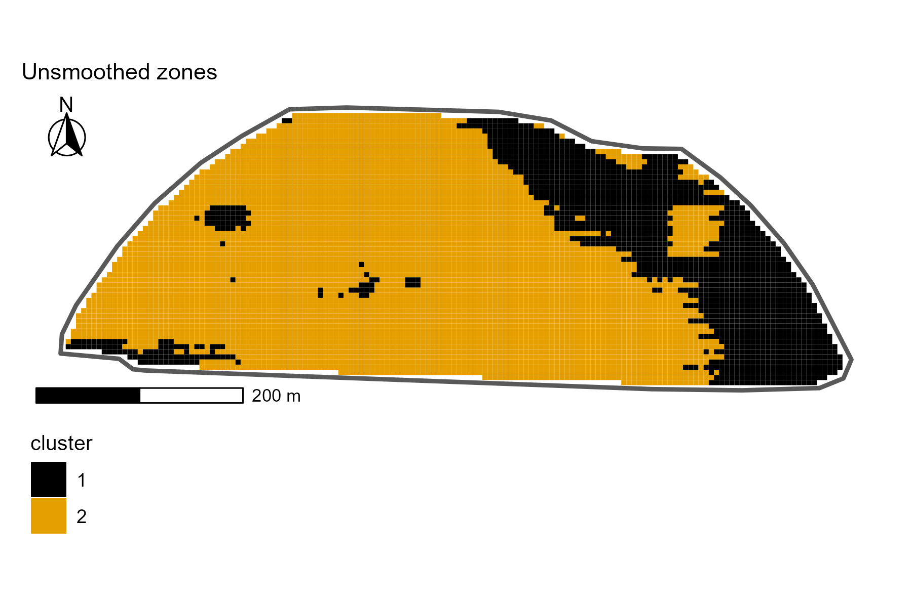

In class, we have used a focal filter to smooth out the zones assignment for our field.

Now, you are asked to play around with the focal filter arguments of **matrix size** and **summary function type**, and answer questions based on the results.

## Instructions and questions

Add your first and last name to the `author` field on the YAML.

1.  Go back to the focal window chunk and play with it by testing the following combinations:\

-   matrix 3 x 3, smooth function of mean\
-   matrix 3 x 3, smooth function of minimum\
-   matrix 3 x 3, smooth function of max

For each of these three new scenarios, create a map with the result making sure the map title (tip: in function `labs()`) reflects the matrix size and function type, and export this plot to your "output" folder in a .png format, following the name scheme of zonesmoothed_matrixsize_function (e.g., zonesmoothed_5x5_mean.png for the settings used in class).

::: callout-warning
You do NOT need to code in this script. All the code to run the focal window, create and export maps should be done in your class script. Here, we are just embedding the figures you created from the class script.
:::

2.  Embed below the zone maps for:\

-   Before smoothing (done in class)\
-   Matrix 5 x 5, smooth function of mean (done in class)
-   Each of the three scenarios ran above

::: {layout-ncol="3"}

:::

After embedding all maps above, answer the following questions:

3.  **Describe what happened visually on the map when you changed the matrix size from 5x5 to 3x3 while using the same function (i.e., mean).**

When the matrix size changed from 5×5 to 3×3, the map became less smooth and more broken up. The 5×5 map looks cleaner, with bigger areas of the same color and smoother edges. But in the 3×3 map, there are more small spots and mixed areas, so it looks more patchy and uneven.

4.  **Describe what happened visually on the map when you changed the function from mean to min, and from mean to max with the matrix size of 3x3.**

With a matrix size of 3×3, changing from mean to max makes the orange areas spread and take over more of the map, while changing from mean to min makes the black areas spread and reduce the orange. The mean stays more balanced, but max favors orange (the larger value - 2) and min favors black (the smaller value - 1).

5.  **Among all the four focal filters we tried, which one would you recommend to be used for this field? Why?**

I would recommend the 5×5 mean filter, beacuse it gives a smoother map with larger, clearer zones and fewer small scattered patches, which makes it easier to see the main patterns in the field, and carry out management practices.This means that it is less noisy and more balanced compared to the 3x3 mean, minimum and maximum.

------------------------------------------------------------------------

After answering all questions, rename this file by adding your first and last name to the end (e.g. A8-questions-Leo Bastos.qmd), render it, and submit on eLC by **Wednesday, March 25 11:59 pm**.
