# Field assignment  
50-ac field:  
  - Dare  
  - Comfort  
  - Brendan    
  - Priscila  

Beach field:  
  - Matteo  
  - Chinonso  
  - Ashton  

# A. Introduction  
After taking the Programming Precision Ag course at UGA, you decided it was time to open your own PA consulting business to offer science-based PA services to producers in Georgia.  

Your first client is Mr. McCormick. He wants to experiment with PA, but has seen his neighbors use out-of-the-box PA services that don't seem to work reliably. He heard about your science-based PA approach, and was very interested in trying out your services in one of his **irrigated** fields. 

Having himself graduated from UGA, Mr. McCormick is very curious about the steps you will be taking and how decisions are made in your workflow.  

Mr. McCormick is interested to learn whether his field has different zones related to yield potential, and if he should use variable rate fertilizer application to reduce costs and improve efficiencies in his operation.  

Mr. McCormick provides you with 4 layers of information from his field: 

- Field boundary  
- Gridded soil data collected in 2025  
- Soil ECa (in dS/m) and elevation collected in 2025     
- Yield data:  
  - Corn yield in 2016  
  - Soybeans yield in 2017    
  - Cotton yield in 2023  
  - Cotton yield in 2024 (for 50-ac field only)  

Mr. McCormick also provides you with the following history of his field:  

- The next crop to be planted will be corn   


# B. Directions  
## Personal information  
Fill in your first and last name on the YAML of this script under the `author` option.  

Add your first and last name to the end of this .qmd script file name.  

## Data  
All data layers above were uploaded to GitHub and can be found in folder `07-finalproject`.  

All layers are in shapefile format.  

## Set up  
Because this is data and analysis for a different field from the one we did in class, you **should not** use the same RStudio project and folders from class.  

As a suggestion, you could follow these steps:  

- On your overall course folder, create a new folder called `finalproject-INITIALS`.  

- Go inside this folder, and create the sub-folders `data`, `code` and `output`.  

- Download the class GitHub repository (https://github.com/leombastos/2026_ppa). 


- Copy the data files from `07-finalproject` and for your **specific field** and paste them inside your `data` folder.  

- Copy the `ProjectInstructions.qmd` file and paste it inside your `code` folder.  

- Launch RStudio.   

- Create a New Project, and have it created at the level of your `finalproject-INITIALS` folder. 

```{r load libraries}
library()
```


## Workflow  
You are required to follow a similar workflow from what we did in class:  

- Interpolate soil grid data for P, K, and pH  
- Wrangle and clean yield data  
- Interpolate cleaned yield data  
- Perform yield stability analysis  
- Use elevation and create all the interpolated terrain variables we did in class  
- Interpolate soil ECa for the two different depths  
- Bring all the layers together to create zones using k-means  
- Smooth zones, validate them with terrain, soil ec, and yield variables  
- Create a (possibly variable rate) N prescription  

Make sure to add the map elements of **scale and north arrow** to every map you make.  

Remember that you will need to adapt our class code to match these new data sets, which may be of different types and have some different column names.  

You can and should use our class code as a reference. However, **make sure you understand what each step and chunk is doing**. Simply copying and pasting and trying to run everything without thinking through will for sure cause lots of code errors, and take away from you the opportunity to revise what we learned in a concise way.  

I would suggest you have a separate quarto script for each step (as we did in class).  

In class, we created a whole new RStudio project for each step. For the final project, you may use just one RStudio project (as explained above), but having different scripts in the `code` folder for the different steps.  

## Troubleshooting  
You will for sure run into code issues.  
This is common and expected, and part of the learning process.  

While this is an individual project, I do encourage all students to help each other, especially as you will likely run into similar problems.  

For that to work, we will be using **GitHub** to ask and answer questions.  

ALL QUESTIONS should be asked in our course GitHub page (https://github.com/leombastos/2026_ppa) under "Issues". **Please do not use email for asking questions**.

Make sure to **"Watch"** the repository so you get notified when someone posts on Issues.  

> I anticipate all of you will have multiple questions. The goal with using GitHub is that you can help each other. You will be graded for participation both in asking questions on GitHub and also helping others with their questions.  

With that, when you have issues running code, here are a few resources you can use, in chronological order:  

- **Yourself**: Read the error message, see if you can interpret it and understand what is going on. A message like "Error: object yield could not be found" is self-explanatory.    
- **Google**: Sometimes just copying an error message and pasting on Google can help you find posts with the answer.  
- **Peers**: ask your classmates using GitHub.  
- **Teaching assistant/Me**: after you have gone through all the sources above without success, the TA and I will certainly be glad to assist you. I want us to be the last resource you use because that's how it will be after our class is finished: I will be available to assist you in anything R-related in your career, but you will also need to attempt solving them before you reach out.  

## Turning it in  
**Failing to follow each and all instructions will make you lose points**.  

- You will turn in **this script** to me.  

- Make sure you do NOT remove any of my instructions/questions.  

- Make sure that when rendered, your questions appear in the table of contents.  

- In this script, you should NOT run analysis-related code.  

- Use this script to only answer your questions with full sentences (proper grammar will be part of your grade), and to bring in figures and/or tables that you created and exported using the analysis scripts.  

- If you want to bring in this script a **figure** that you created using a different script that exported it to the `output` folder, and assuming this script is in your code folder, you would do so by using the following code:

``

- When creating figures, make sure to add a descriptive title, and that legends are professional and include units.  

- When creating figures and using `color` or `fill`, make sure to use an inclusive, colorblind-friendly palette.  

- If you want to bring in this script a **data frame** (e.g. with a summary) that you created using a different script, you can export that summary as a csv file, and then import it here using a `read_*()` function.  

- Make sure to avoid chunks printing unnecessary messages and warnings. For that, you may use chunk options as we showed in class, e.g. `#| warning: false` at the beginning of the chunk. 

- Make sure to avoid long prints. You can use the function `head()` to solve that.  

- If/when you need to use code in this script, make sure it does not appear on the rendered version. Think of this script as what you would turn in to your customer, who doesn't understand or care about programming languages and their code.  

- Make sure you render it and check how it looks. If things look weird on the rendered version, fix them so they look right and professional. 

# C. Grading  
There are some opportunities for **extra credit**. Extra credit questions, if answered correctly, will replace the grade of other answers that you may have missed.   

You will be graded based on:  

- correctly answering questions (make sure you answer all parts of a question for full credit)  
- following all directions  
- proper grammar  
- professionalism of your rendered file  
- using GitHub both to ask questions and help others  
- turning in on time  

# D. Questions  
Once you get started and as you progress in the project tasks, Mr. McCormick is following closely your work and has multiple questions for you:

## 1. Show a map of the interpolated soil gridded variables of P, K, and pH. Provide an interpretation. On your color legend, use the color brakes according to sufficiency levels for corn.  
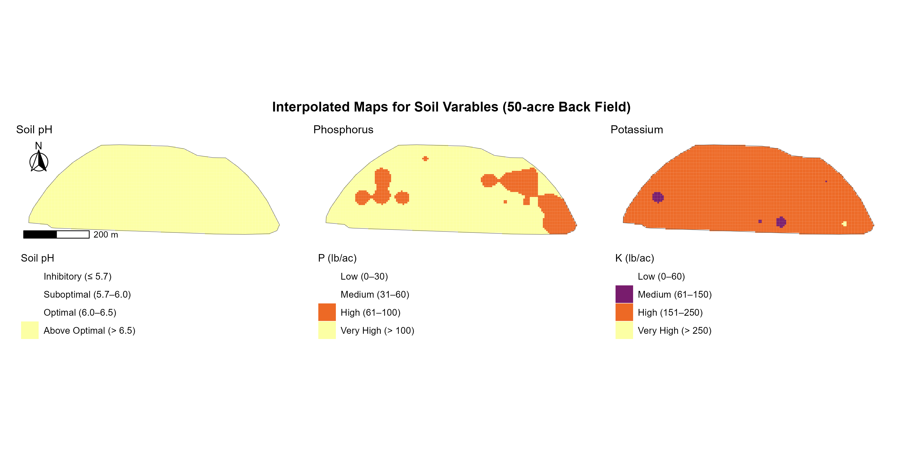
For soil pH the entire field is Above Optimal (> 6.5) based on the UGA recommendations  for corn (https://aesl.ces.uga.edu/publications/soil/cropsheets.pdf). So it is suggested that no lime needed. Additionally, phosphorus level for the field is Mostly Very High (> 100 lb/ac) with some High patches. Hence, phosphorus fertilizer can be skipped or minimized. Lastly, potassium is also Mostly High (151–250 lb/ac) with small Medium spots, and a tiny bit of Very high (>250). A variable-rate K application targeting the Medium zones would be cost-effective.

## 2. What is the number of observations, minimum, mean, maximum, and standard deviation for the **raw** yield data (in bu/ac)? Show Mr. McCormick a plot with the density distribution of the **raw** yield data for each year available. 

```{r}
read_rds("../output/all_ys_raw_table.rds")
```
The raw yield data shows clear outliers across most years. Corn (2016), soybeans (2017), and cotton (2023) all have minimums at or near zero and extreme maximum values. For example, 872 bu/ac for corn, 274 bu/ac for soybean (compared to mean), and 46,144 lb/ac for cotton in 2023 which are unrealistic.

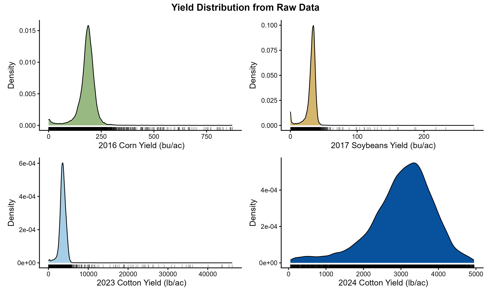

The density plots confirm the raw data summary from the table above, showing tight peaks at realistic yields with long tails stretching far to the right. The 2024 cotton data is the cleanest, with a smooth bell-shaped distribution and an almost reasonable maximum of approximately 4,950 lb/ac. Overall, the raw data needs filtering before meaningful analysis and drawing proper conclusions.


## 3. How many meters of negative buffer did you use for this field? Was that enough to remove low yielding data points near the field border? Show Mr. McCormick a map with the field border, points colored by raw yield data from one of the years, and the buffer outline. 

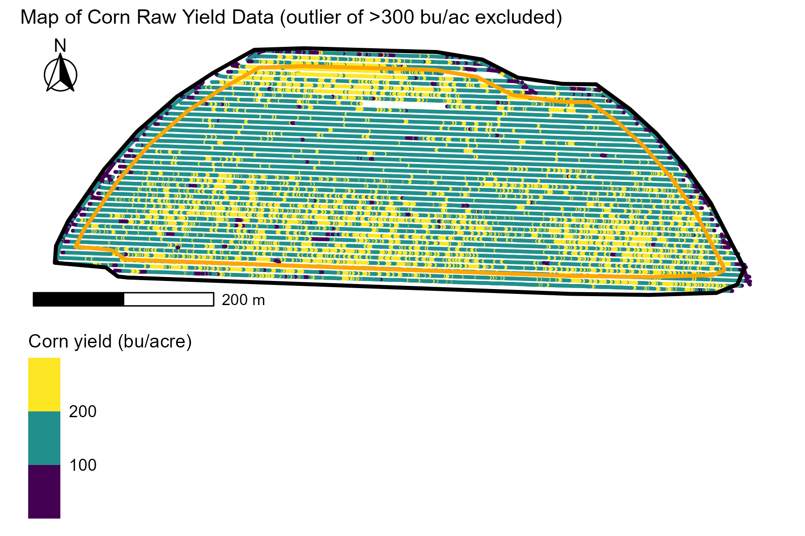
I used a 20 m negative buffer from the field boundary. The map shows the original boundary (black), the buffered boundary (orange), and the raw 2016 corn yield points. Most low-yielding points (purple) cluster just outside the orange buffer line — confirming the buffer captured the bulk of edge effects from headland turns and partial swaths. A few low-yielding points remain inside the buffer in the southern corners, but increasing the buffer further would remove too much usable data from this 50-acre field. The 20 m buffer was a reasonable balance between cleaning edge artifacts and preserving data.

## 4. What is the number of observations, minimum, mean, maximum, and standard deviation for the **cleaned** yield data (in bu/ac)? Show Mr. McCormick a plot with the density distribution of the **cleaned** yield data for each year.  

The cleaned yield data summary statistics for each crop year are shown below:
```{r}
read_rds("../output/all_ys_clean_table.rds")
```

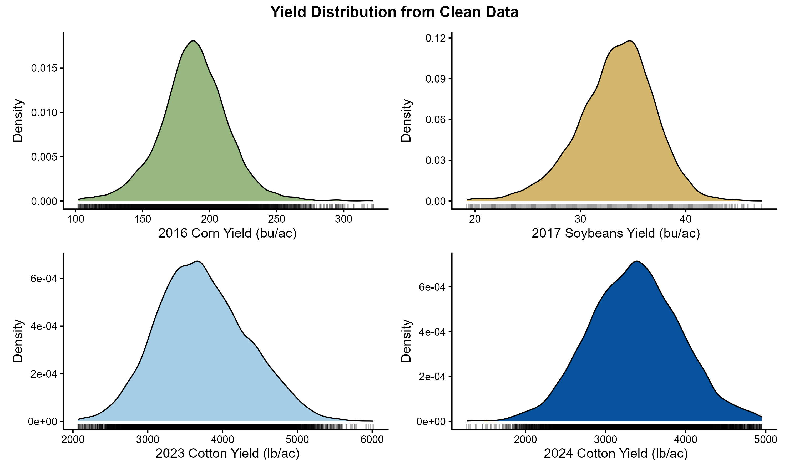
After cleaning, the four crop years showed clean, single-peaked distributions as seen above: 2016 corn (n=18,078, mean=188.6 bu/ac, SD=25.5), 2017 soybeans (n=11,926, mean=33.4 bu/ac, SD=3.7), 2023 cotton (n=11,333, mean=3,735.5 lb/ac, SD=601.2), and 2024 cotton (n=9,882, mean=3,363.4 lb/ac, SD=567.5). All distributions are approximately normal with mild right-skew, confirming the cleaning successfully removed yield monitor errors and produced reliable data for analysis.

## 5. When creating a grid for interpolation, what grid cell size did you use? Why did you select this size?  

I used a 5 × 5 m grid cell size for interpolation. This resolution matches the density of yield monitor data (which records every 1–3 m), aligns with the spatial precision of variable-rate application equipment (which adjusts over 5–10 m), and produces smooth maps without unnecessary computation. Using the same 5 m grid for all variables (yield, soil ECa, nutrients, terrain) ensures all layers align at the same resolution for clustering and zone analysis.

## 6. Show Mr. McCormick a map of the cleaned interpolated yield data for each year (include the field boundary).  

Mr. McCormick, these are the cleaned, interpolated yield maps for your field across four crop years. 2016 corn averaged ~180–220 bu/ac uniformly. 2017 soybeans showed a high-yielding central band (~35 bu/ac) with lower yields at the edges. 2023 cotton showed a similar central high-yield band (~4,500–5,000 lb/ac). 2024 cotton showed the strongest east-vs-west pattern, with the eastern strip yielding noticeably lower (~2,500 lb/ac) than the rest of the field. The eastern edge consistently appears as the lowest-yielding zone across years, though the magnitude varies.

## 7. Create yield spatial-temporal variability classes using yield data from all available years. Include here the maps for standardized yield mean, coefficient of variation, and classes. What proportion of pixels were found within each class?  

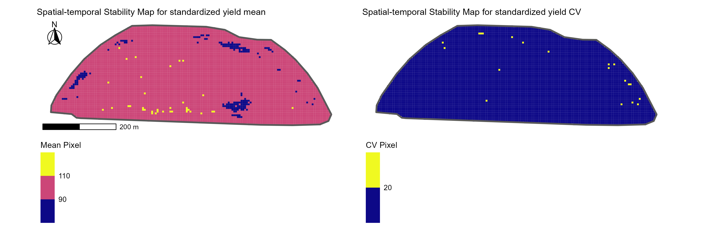


```{r}
read_rds("../output/stab-class_prop.rds")
```
Stability classes were created using standardized yield mean and CV across four crop years. The field is overwhelmingly medium-stable (96.3%), with small amounts of low-stable (2.9%), high-stable (0.6%), and unstable (0.3%) pixels. This confirms the field's uniform yield behavior across years, with limited spatial-temporal yield differentiation.

## 8. Show Mr. McCormick a map of the interpolated terrain variables (include the field boundary).

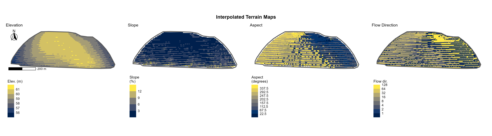

The elevation map shows that the highest ground (~61 m) runs through the center of the field, with lower areas (~56 m) along the southern edge and the eastern strip — a total range of about 5 meters across the field. The slope map shows that most of the field is fairly flat (under 6%), with steeper areas (up to 12%) concentrated along the eastern edge where elevation drops off. The aspect map shows the direction each part of the field faces: the northern half tilts northward, while the southern half tilts southward, reflecting the central ridge running east-west across the field. The flow direction map shows how surface water would move across the field — water flows away from the central high ground toward both the northern and southern edges.
The key takeaway: your field has a low ridge running through the middle, with gentle drainage to the north and south, and a steeper drop along the eastern edge. The eastern edge is the same area we identified as the more variable yield zone — its combination of heavier soil and steeper slope means it both drains differently and is more sensitive to weather extremes than the rest of the field.

## 9. Show Mr. McCormick a map of the interpolated soil ECa variables (include the field boundary). 

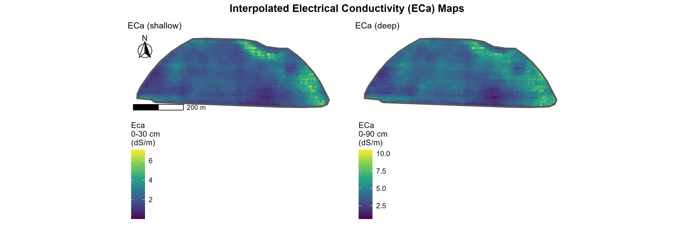
Mr. McCormick, these maps show electrical conductivity (ECa) at the topsoil depth (0–30 cm) and through the full root zone (0–90 cm). Most of your field has lower ECa (blue), but there's a strip along the eastern edge with higher conductivity (green/yellow). This indicates heavier, more clay-rich soil along that eastern strip — which matches the more variable yield zone we identified in the analysis.

## 10. Use all interpolated field-related variables (soil P, K, pH, soil EC at two depths, soil terrain properties) to create zones. How many clusters/zones did you decide that this field needs? What metric did you use to make this decision? (check the `Code tips` section below for a note on this).  

2 clusters and it was the best based on running the analysis (wss and sihoulette). i ran for multiple methods too and 2 was voted as the best.
I decided that this field needs 2 clusters/zones. This was determined using both the within-cluster sum of squares (WSS, elbow method) and the silhouette score, which both indicated 2 clusters as optimal. I also ran the analysis with multiple clustering methods, determined using NbClust and 2 clusters was consistently selected as the best solution across them.

## 11. When smoothing clusters, play around with a few matrix sizes (3x3, 5x5, 7x7) and summarizing functions (mean, median, maximum), then choose one option to continue. Show maps for all combinations of window size and summarizing function. After experimenting with them, which matrix size and summarizing function did you decide to keep? Why? Show Mr. McCormick a map of the final smoothed clusters/zones below (include field boundary).  

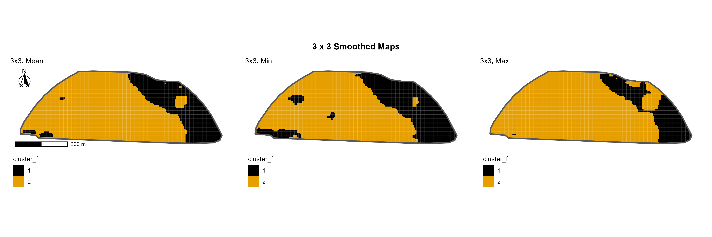


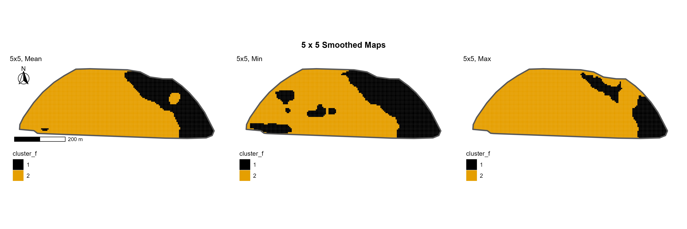


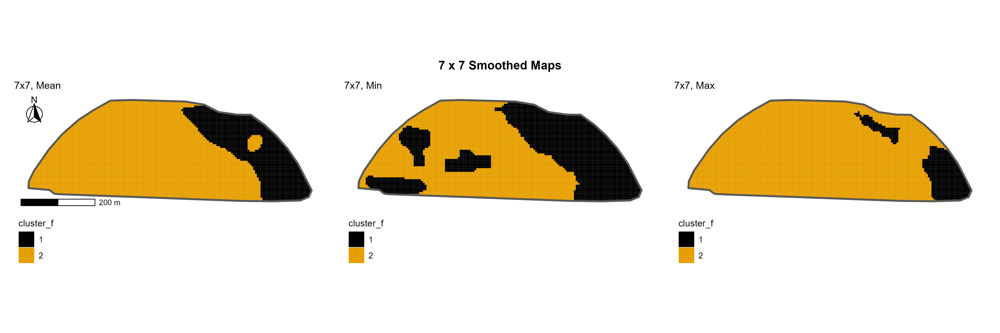


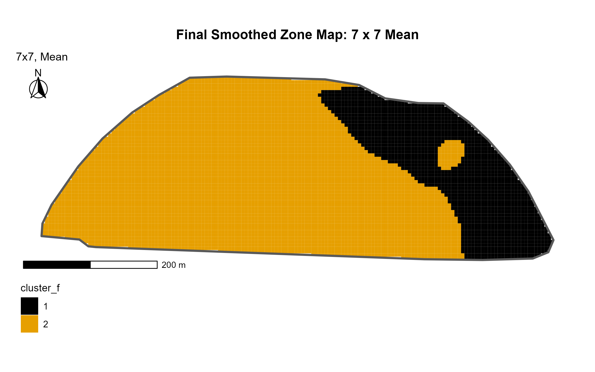

The 7×7 mean was selected as the final smoothing window because it produced clean, contiguous zones suitable for variable-rate management. It removed isolated noise and rough boundary edges while preserving the dominant pattern — a low-stability zone along the eastern edge and a stable zone across the western two-thirds. Smaller windows (3×3, 5×5) retained more speckle, while min/max functions biased the result toward one cluster. The 7×7 mean balanced noise reduction with meaningful feature preservation.

## 12. Use the standardized mean yield (calculated on the spatial-temporal stability analysis) data to validate the clusters. Show below a boxplot of standardized yield data mean for all years for the different clusters. Based on these boxplots, how would you characterize each cluster (e.g., cluster x is high yielding zone and cluster y is low yielding zone). **Extra credit**: include the analysis of variance letter separation on the boxplots.   

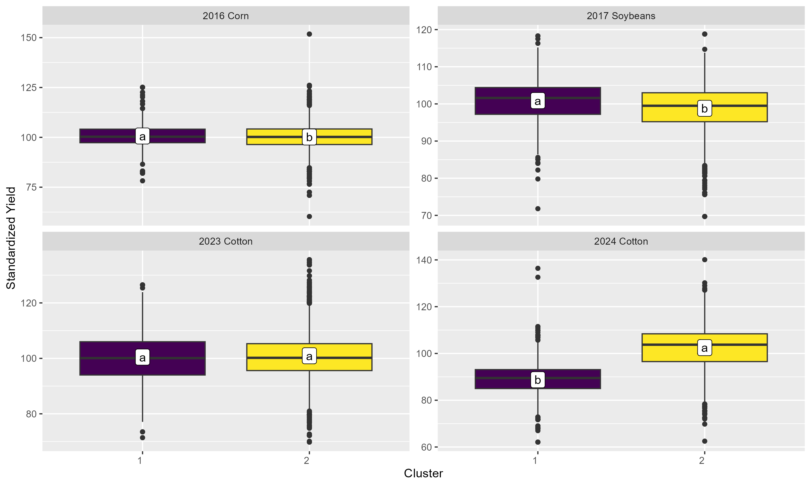
Tukey HSD letter separation showed clusters differed significantly in 2016 corn, 2017 soybeans, and 2024 cotton, but not in 2023 cotton (both 'a'). Cluster 1 was slightly higher-yielding in 2016 and 2017 (1–2 percentage points), but Cluster 2 was higher-yielding in 2024 cotton by ~15 percentage points — the only year with a practically meaningful difference.
Neither cluster is consistently high- or low-yielding across years. The clustering captures real yield variation, but its expression depends on crop and year, with the 2024 cotton year showing the clearest cluster differentiation.

## 13. What was the proportion of high and low yield areas for each of the zones?  

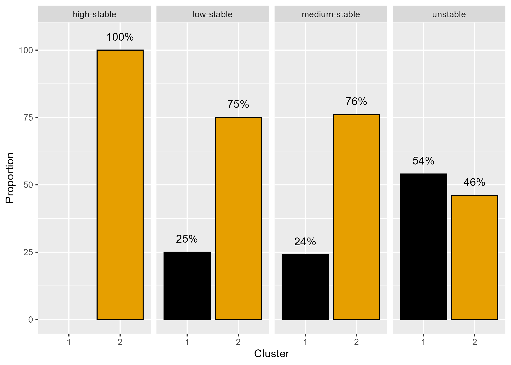

The plot shows the cluster distribution within each stability class. All high-stable pixels (100%) and the majority of low-stable (75%) and medium-stable (76%) pixels are in Cluster 2. Unstable pixels are roughly split, with a slight majority (54%) in Cluster 1.
This suggests Cluster 2 captures the field's stable yielding areas, while Cluster 1 is enriched with the more variable, less predictable pixels.

## 14. Now that we know the yield class of each cluster, how are they affected by soil P, K, pH, soil ECa at different depths, and by elevation (e.g., high yield cluster has higher/lower eca, etc.)? Include below a boxplot to explore those relationships similarly to how we did in class. **Extra credit**: include the analysis of variance letter separation on the boxplots.   

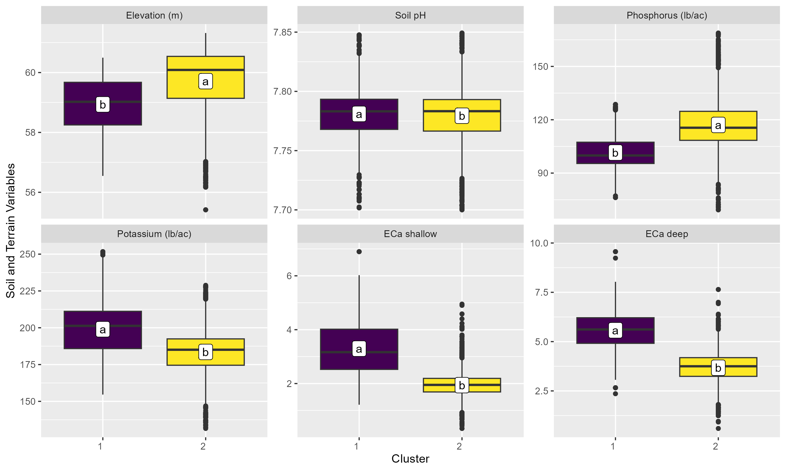
Cluster 1 had higher ECa (both shallow and deep), higher K, lower P, and slightly lower elevation than Cluster 2. Soil pH did not differ between clusters (both ~7.78). The higher ECa values in Cluster 1 indicate heavier, more clay-rich soils with greater water retention, while Cluster 2's lower ECa points to lighter, better-drained soils on slightly higher ground. These soil and topographic differences explain why Cluster 2 (the stable yielding zone) maintained more consistent yields across years — its lighter soils and better drainage buffer it against weather variability — while Cluster 1's heavier soils make it more reactive to wet/dry conditions, producing the variable yield behavior.

## 15. Were you able to validate clusters with temporal yield data? Explain why/why not.  

Partially. Yield differences between clusters were statistically significant in three of four years, but the magnitude was small (1–2 percentage points) in 2016 and 2017, and the cluster rank reversed in 2024 (where Cluster 2 became higher-yielding by ~15 points). The 2023 cotton year showed no difference at all. The clusters did not behave as stable "high-yield" and "low-yield" zones across years. Soil and terrain analysis provided clearer validation, showing consistent differences in ECa, K, P, and elevation between clusters. The field's overall yield uniformity (max CV = 27%) likely limited the ability of any clustering to produce strong year-over-year yield separation.

## 16. What was the yield potential (in bu/ac) of each zone? How did you determined it?   

```{r}

#|message: FALSE
#|warning: FALSE
read_csv("../output/yp_zone.csv",
         show_col_types = FALSE)
```
Yield potential was determined as the 90th percentile of cleaned 2016 corn yields within each cluster. I used 2016 corn data because corn is the crop to be planted next season, making it the most relevant year for setting upcoming yield goals. The 90th percentile is a standard yield-goal benchmark representing achievable yield under favorable conditions. Cluster 1 yielded 201.1 bu/ac and Cluster 2 yielded 201.5 bu/ac — essentially identical (0.3 bu/ac difference), confirming uniform yield potential across both zones.

## 17. How did you determine the total N rate (what algorithm, from which website)?  

```{r}
read_csv("../output/total_nrate.csv",
         show_col_types = FALSE)
```


I used the UGFERTEX and also an article by Glen Harris that gives the same value as the UGFERTEX where amount of nitrogen required should be 1.2  lb of nitrogen per bushel of corn planned to make (that is, the yield potential). Websites are seen below:

https://site.extension.uga.edu/colquittag/2022/01/corn-fertilizer-use/
https://aesl.ces.uga.edu/calculators/ugfertex/


## 18. What was the in-season N rate (in lbs N/ac) of each zone? Show below a map with this information (include field boundary).  

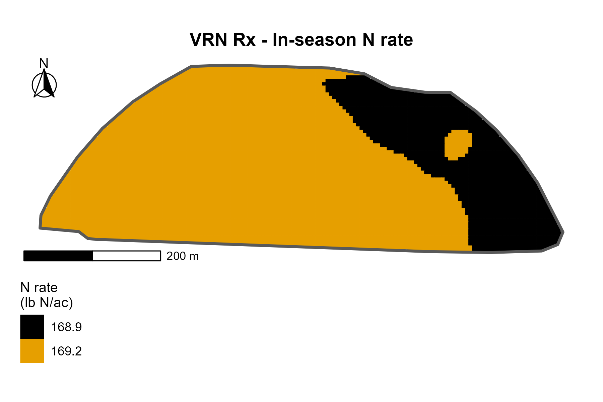
The in-season nitrogen rate for each zone was calculated based on the yield potential of each zone (Cluster 1 = 201.1 bu/ac, Cluster 2 = 201.5 bu/ac), using a standard N requirement of approximately 1 lb N per bushel of corn yield goal, adjusted for residual soil N and other credits.
- Cluster 1 (Low zone): 168.9 lb N/ac
- Cluster 2 (High zone): 169.2 lb N/ac
The two zones differ by only 0.3 lb N/ac — a difference too small to be agronomically or economically meaningful, and well below the spatial precision of variable-rate application equipment. This confirms that uniform N application would be appropriate for this field.

## 19. What was the in-season UAN28% rate (in gal/ac) of each zone? Show below a map with this information (include field boundary).  

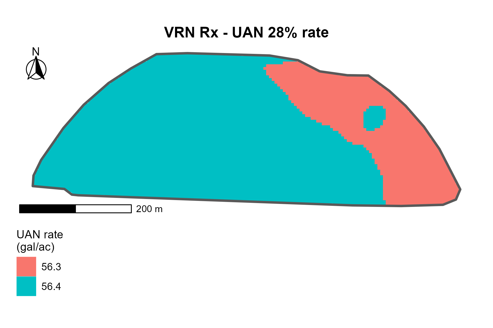
The N rate was converted from lb N/ac to gal/ac of UAN 28% solution using the standard conversion factor (UAN 28% contains approximately 3.0 lb N/gallon).
- Cluster 1 (Low zone): 56.3 gal/ac
- Cluster 2 (High zone): 56.4 gal/ac
The two zones differ by only 0.1 gal/ac of UAN 28% — again, an agronomically and economically negligible difference. The conversion confirms what the N rate map already showed: variable-rate UAN application is not justified for this field.

## 20. Based on the answers above, would you recommend Mr. McCormick to treat his field using variable rate N application? Why/why not? Explain as if you were speaking with him.  

Mr. McCormick, I would not recommend variable-rate N for this field. The two zones would receive 168.9 vs 169.2 lb N/ac — a difference of just 0.3 lb/ac, which is smaller than any equipment can deliver and far too small to matter economically.
Your field is unusually uniform. Four years of yield data showed low within-field variability, and the two zones produce very similar yields in most years. While we did find real soil texture differences between the zones, they haven't translated into different yield potentials.
I'd recommend a uniform rate of about 169 lb N/ac across the whole field. Splitting it by zone would add complexity and cost without any agronomic benefit. Save variable-rate N for fields with greater yield differences between zones.

## 21. Regardless of your recommendation above, Mr. McCormick will still need to apply N to this field. How many gallons of UAN28% would Mr. McCormick need to order for his in-season N application for this field?  

2640 gallons of UAN28% in total (including an extra 20%).

## 22. Download the growing-season mean GNDVI from Sentinel-2 for each year of yield data. For soybeans and corn, define the growing season dates as from May 1st through October 15. For cotton, define the growing season from June 1st through November 30. Use the growing-season mean GNDVI to create remote-sensing based spatial-temporal stability classes. Include here the map of the standardized mean GNDVI, CV, and of spatial-temporal classes. Also include here the previous yield-based spatial-temporal stability class map. How do they compare? How well did the remote sensing-based analysis compared to the yield-based analysis?   

## 23. **Extra credit** Tell me what was your most favorite part of this entire course. Explain in detail why.  

## 24. **Extra credit** Tell me what was your least favorite part of this entire course. Explain in detail why.  


# E. Submitting and deadline  
All I need is the rendered version of **this script**. 

Submit your file on eLC by **April 29** 11:59 pm.

# F. Code tips  
## Data import  
- Check that the path you are specifying is correct  
- Check that you are using the proper function based on the file type (read_csv for csv files, read_sf for shape files/vector data)  
- To import a shapefile, specify the `.shp` file in the path inside `read_sf()` function.   

## Troubleshooting a pipe stream  
- If you run a pipe stream (multiple functions connected by multiple pipes) and there is error in the code, comment off the first pipe, run it. If problem did not appear, uncomment this first pipe, comment off second pipe, run it. Keep doing this until you find what function in the pipe is causing the error. That will make it easier to pinpoint where the error is coming from and address it.  

## K-means: finding k  
- When defining the proper number of clusters (k) for this data, only use the techniques `WSS` and `Silhouette width`. **Do not** attempt to run the analysis code that contains multiple indices (function `NbClust()`). I tried that on my computer, and for some reason it was not working properly, and it also takes a long time to run which was making my RStudio crash.  


## Exporting spatial data to file  
- To export a spatial vector to file, we use the function `write_sf()`. Don't forget to change one of its arguments to make sure you don't append (duplicate the number of rows) in case you already have the same file saved from a previous run: `write_sf(delete_dsn = T)`.  
